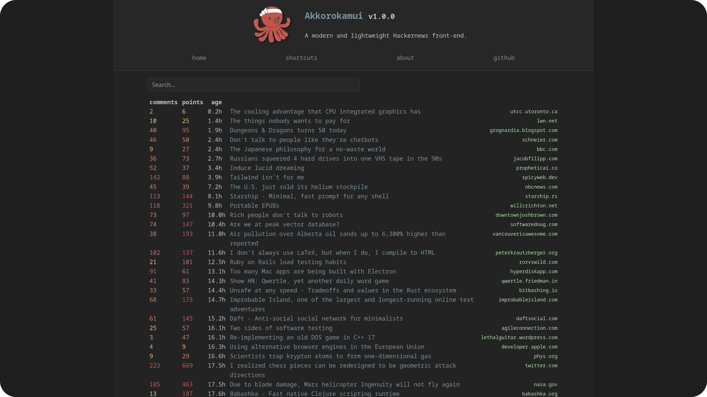

A modern and lightweight Hackernews frontend.

## Index

- [Features](#features)
- [Installation](#installation)
- **[Instances](#instances)**

## Features

- **lightweight**
- **responsive layout**
- **light and dark mode** support
- designed as a **SPPWA**
- **asynchronous**
- aggressive caching
- strict mode JavaScript and strictly typed PHP

### What does Akkorokamui mean?

According to legends, [Akkorokamui](https://en.wikipedia.org/wiki/Akkorokamui) (Japanese: アッコロカムイ) is a gigantic octopus-like monster from Ainu folklore, similar to the Nordic Kraken, which supposedly lurks in Uchiura Bay in Hokkaidō (Japan).

## Installation

### Prerequisites

Akkorokamui was developed without the help of frameworks or third-party libraries that are not available in the repositories of major GNU/Linux distros.

No compilation tools (such as make or meson) or third-party package managers (such as composer, pip, or npm) are required, just the basic PHP (8.2+) package and the CURL extension.

**Debian**-based distros (Ubuntu, Mint, Raspberry Pi OS...) users:

```bash
sudo apt install --no-install-recommends php-cli php-curl
sudo apt install --no-install-recommends php-apcu # optional, but highly recommended to improve performance
```

**Arch**-based distros (EndeavourOS, Manjaro, Garuda...) users:

```bash
sudo pacman -Syu --needed php
sudo pacman -Syu --needed php-apcu # optional, but highly recommended to improve performance
```

### Automated (GNU/Linux only)

```bash
export XDG_DATA_HOME=${XDG_DATA_HOME-~/.local/share}
mkdir -p $XDG_DATA_HOME && cd $_
curl -LO https://github.com/hisutori/akkorokamui/releases/latest/download/akkorokamui.zip
unzip akkorokamui.zip && rm akkorokamui.zip && cd akkorokamui/public
PHP_CLI_SERVER_WORKERS=2 php -S 0.0.0.0:8000
```

Open your browser and visit [http://localhost:8000](http://localhost:8000).

To start automatically the webserver at system boot, you can use a systemd unit:

```bash
export XDG_CONFIG_HOME=${XDG_CONFIG_HOME-~/.config}
mkdir -p $XDG_CONFIG_HOME/systemd/user && cd $_
{
  echo '[Unit]'
  echo "Description=Akkorokamui's http daemon"
  echo '[Service]'
  echo 'Type=oneshot'
  echo 'Environment="PHP_CLI_SERVER_WORKERS=2"'
  echo "WorkingDirectory=$XDG_DATA_HOME/akkorokamui/public"
  echo 'ExecStart=/usr/bin/php -S 0.0.0.0:8000'
  echo '[Install]'
  echo 'WantedBy=multi-user.target'
} >> akkorokamui.service
systemctl --user enable --now akkorokamui.service
```

### Docker

```bash
curl -LO https://github.com/hisutori/akkorokamui/releases/latest/download/akkorokamui-docker.zip
unzip akkorokamui-docker.zip && rm akkorokamui-docker.zip
docker-compose up -d --build
```

Open your browser and visit [http://localhost:8000](http://localhost:8000).

## Instances

| Instance | Location | HTTP3 | Cloudflare |
| -------- | :------: | :---: | :--------: |
